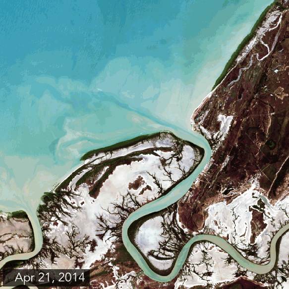
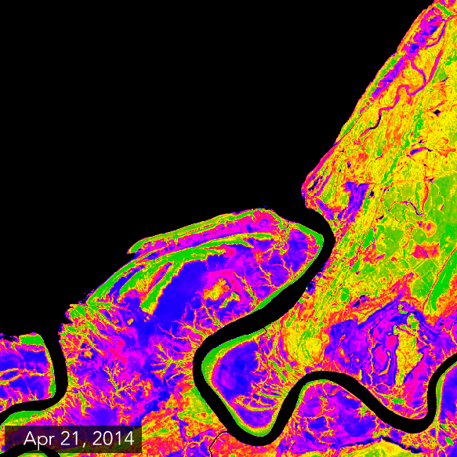

I first [read about this on the ABC website](http://www.abc.net.au/news/2016-07-10/unprecedented-10000-hectares-of-mangroves-die/7552968), it's another concerning sign in amongst a raft of environmental changes. I'd recommend watching the footage in this link for a first hand view of whats occurred.

Tracking down an affected location wasn't hard. The following images were cropped out of the Landsat8 scenes (path 99 row 72) near the town of [Karumba](https://en.wikipedia.org/wiki/Karumba,_Queensland).

 
Karumba as seen by Landsat8 - natural colour

This image is a natural colour image making use of bands 4,3,2 (red, green, and blue) to give a natural looking image. The affected mangrove area can be seen on the along the top right foreshore. Here we see the initially green mangroves turn grey.

Applying the Soil-Adjusted Vegetation Index (SAVI) filter, gives us a better contrasted view of what has changed. Much like the NDVI, SAVI is a ratio between red and near-infrared reflectance values. Green leafy plants reflect infrared light very differently to dead plants. In the below image bright green represents healthy plant life, red little vegetation, and dark blue/black is no vegetation or water.

 
Karumba as seen by Landsat8 - SAVI

Image credit: generated by ObservedEarth using using Landsat data from the [USGS](http://glovis.usgs.gov/).
